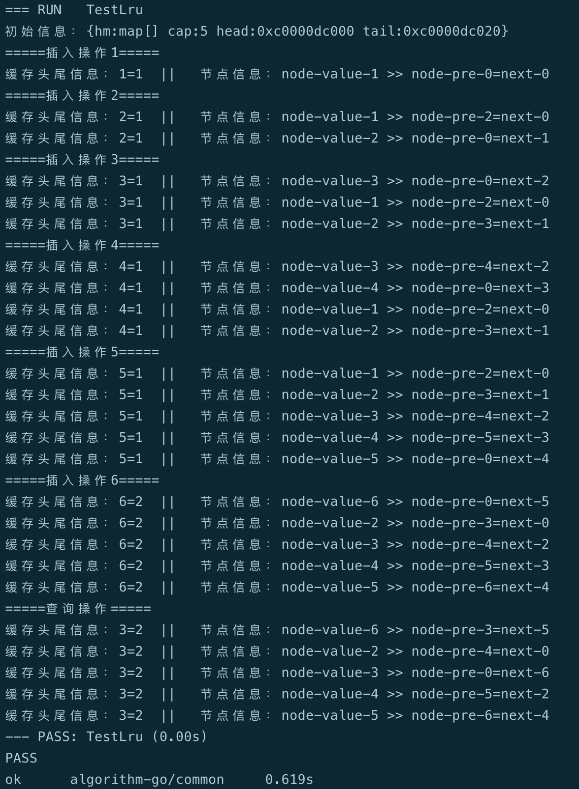
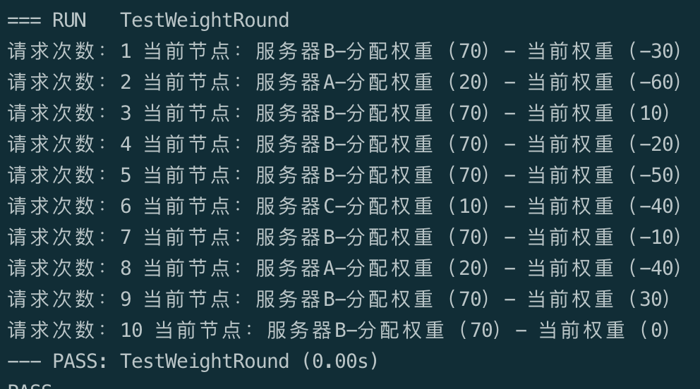

# algorithm-go
算法练习-go

### 排序算法
> - 冒泡排序 O(n2)
> - 鸡尾酒排序 O(n2)
> - 快速排序 O(nlogn)
> - 堆排序 O(nlogn) 
> - 计数排序 O(n)
> - 桶排序 O(n)

### 查找算法
> - 顺序查找
> - 二分查找
> - 插值查找
> - 斐波拉契查找
> - 树表查找
> - 分块查找
> - 哈希查找

### 最优决策
> - 动态规划
> - 最短路径

### 其他常用算法
> - LRU缓存淘汰算法（最近最少使用策略）: [代码片段](../main/common/lru.go)

> - 加权轮询算法：[代码片段](../main/common/weight_round.go)
    

### Reference
> - [算法题](https://github.com/CyC2018/CS-Notes/blob/master/notes/%E5%89%91%E6%8C%87%20Offer%20%E9%A2%98%E8%A7%A3%20-%20%E7%9B%AE%E5%BD%95.md)
> - [算法思维](https://labuladong.gitbook.io/algo/) 
> - [leetcode](https://leetcode-cn.com/problemset/algorithms/)
> - [查找算法](https://zhuanlan.zhihu.com/p/64940290)

### 推荐书籍
> - 小灰的算法之旅
> - 啊哈!算法